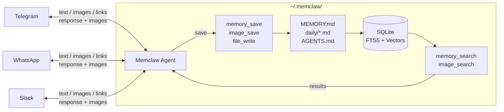

<div align="center">


**Your personal memory vault, powered by AI.**

Store your thoughts. Save your images and links. Ask anything, anytime.

[](LICENSE)
[](https://www.python.org/downloads/)
[](https://docs.anthropic.com/)
[](https://core.telegram.org/bots)
[](https://github.com/krypton-byte/neonize)
[](https://api.slack.com/bolt)
[](CONTRIBUTING.md)

</div>

---

Memclaw is a lightweight, local-first personal memory assistant. It stores your thoughts, notes, images, and links as **plain Markdown files** and makes them instantly searchable through **hybrid vector + keyword search**.

Think of it as your second brain — one that actually remembers.

<p align="center">
  
</p>

## Why Memclaw?

[OpenClaw](https://github.com/openclaw/openclaw) is great — but it connects to dozens of tools, reads your filesystem, runs shell commands, and does a hundred things you didn't ask for. That makes it slow, expensive, and a security surface you have to think about every time you use it.

Memclaw takes one slice of what OpenClaw does — **memory** — and does it really well, without the rest.

**Total recall.** Save a thought today, retrieve it six months later with a vague description. *"What was that restaurant Alex told me about?"* — Memclaw finds it. Hybrid vector + keyword search means you don't need to remember exact words.

**Visual memory.** Send an image and Memclaw generates an AI caption, indexes it, and stores it. Later, just ask *"that food recipe photo"* or *"the whiteboard from last sprint"* and it comes right back.

**Link memory.** Drop a link and Memclaw fetches the page, summarizes it, and indexes the content. Months later, ask *"that article about distributed databases"* and it surfaces the link with context — no bookmarking app needed.

**Reminders, too.** Ask *"remind me tomorrow at 9am to call Alex"* and the bot pings you back in the same chat. One-shot or recurring.

**Sandboxed by design.** Memclaw only touches `~/.memclaw/`. No filesystem access, no shell commands, no path traversal. You don't need to trust it with your whole computer — it can't see it.

**Lightweight and cheap.** No Docker. No Postgres. No sprawling tool graph burning tokens. Just Python, SQLite, and two API keys. Fast responses, minimal cost.

## Quick Start

```bash
pip install memclaw
memclaw
```

On first run, Memclaw will prompt you for your API keys and save them to `~/.memclaw/.env`. You can update them anytime with `memclaw configure`.

## Messaging Platforms

The main way to use Memclaw. Just talk to it naturally — no commands needed. Send text, photos, voice messages, or links, or ask to be reminded later. The agent figures out what to do: store it, search your memories, retrieve images, schedule a reminder, or just chat.

All platforms share the same agent, memories, and search index — your data is unified regardless of how you interact.

### Telegram Bot

The Telegram bot shows a **typing indicator** while processing so you know it's working on your request.

#### Setup

1. Create a bot via [@BotFather](https://t.me/BotFather) and copy the token.
2. Get your Telegram user ID (e.g. via [@userinfobot](https://t.me/userinfobot)).
3. Start the bot — on first run you'll be prompted for all keys:

```bash
memclaw telegram
```

### WhatsApp Bot

Uses your **personal WhatsApp account** via WhatsApp Web pairing — no Meta Business account, no webhooks, no public server. Powered by [`neonize`](https://github.com/krypton-byte/neonize) (whatsmeow under the hood).

#### Prerequisite: libmagic

neonize depends on `python-magic`, which needs the `libmagic` system library:

- macOS: `brew install libmagic`
- Debian/Ubuntu: `sudo apt install libmagic1`
- Fedora/RHEL: `sudo dnf install file-libs`

#### Setup

```bash
memclaw whatsapp
```

On first run a QR code is printed to your terminal. On your phone: **Settings → Linked Devices → Link a Device**, and scan it. The session persists under `~/.memclaw/whatsapp/` so you only pair once.

Only messages you send to yourself (via WhatsApp's "Message Yourself" chat) are processed. DMs from other people and group messages are ignored.

### Slack Bot

The Slack bot connects via **Socket Mode** (WebSocket) — no public URL or webhook server needed.

#### Setup (from manifest — recommended)

1. Go to [api.slack.com/apps](https://api.slack.com/apps) → **Create New App** → **From a manifest**, pick your workspace, and paste:

    ```yaml
    display_information:
      name: Memclaw
      description: Your personal memory vault, powered by AI.
      background_color: "#1a1a1a"
    features:
      bot_user:
        display_name: Memclaw
        always_online: true
      app_home:
        home_tab_enabled: false
        messages_tab_enabled: true
        messages_tab_read_only_enabled: false
    oauth_config:
      scopes:
        bot:
          - app_mentions:read
          - channels:history
          - chat:write
          - files:read
          - files:write
          - im:history
          - im:read
          - im:write
    settings:
      event_subscriptions:
        bot_events:
          - app_mention
          - message.im
      interactivity:
        is_enabled: false
      socket_mode_enabled: true
    ```

2. **Install to Workspace** and copy the **Bot Token** (`xoxb-...`).
3. Under **Basic Information → App-Level Tokens**, generate a token with `connections:write` scope and copy it (`xapp-...`).
4. Start the bot:

```bash
memclaw slack
```

You can DM the bot directly or mention it in channels (`@Memclaw save this...`). Optionally restrict it to specific channels with `SLACK_ALLOWED_CHANNELS`, or to specific users with `SLACK_ALLOWED_USERS` (find your Slack ID via **Profile → ••• → Copy member ID**).

To update keys later: `memclaw configure`.

### What it handles

| Message type | What happens |
|-------------|-------------|
| **Text** | Agent decides: store as memory, search existing memories, or both. Links are extracted, fetched, and summarized automatically. |
| **Photo** | AI-described via vision model, stored and indexed. Agent acknowledges and responds. Saved for later retrieval. |
| **Voice / Audio** | Transcribed via Whisper, stored as text. Agent responds to the content. Links extracted. |
| **Reminders** | One-shot (`remind me tomorrow at 9am to call Alex`) or recurring (`remind me every 5 hours to drink water`). Delivered back to the same chat. List with *show my reminders*, cancel by id. |

### Examples

```
> Just had coffee with Alex. She's moving to Berlin for a role at Stripe.
Got it! I've saved that Alex is moving to Berlin for a new role at Stripe.

> Who is Alex?
Based on your memories, Alex is someone you had coffee with recently.
She's moving to Berlin for a new role at Stripe.

> Show me the whiteboard photo from last week
[sends the matching photo]
Here's the sprint planning whiteboard you saved last week.

> Remind me tomorrow at 9am to call Alex
Reminder #4 scheduled for 2025-06-16T09:00.
```

## How It Works



Memclaw draws inspiration from [OpenClaw](https://github.com/openclaw/openclaw)'s memory architecture and uses the [Anthropic API](https://docs.anthropic.com/) directly with a lightweight agentic loop.

### Storage Layer

All memories are plain Markdown — human-readable, editable, and git-friendly.

| File | Purpose |
|------|---------|
| `~/.memclaw/MEMORY.md` | Curated long-term facts and preferences |
| `~/.memclaw/AGENTS.md` | Customizable agent instructions and user preferences |
| `~/.memclaw/memory/YYYY-MM-DD.md` | Timestamped daily entries |
| `~/.memclaw/memclaw.db` | SQLite index (vector embeddings + FTS5) |

### Search Layer

Every memory is chunked, embedded, and indexed in SQLite. Retrieval combines two signals:

- **Vector search** (70% weight) — cosine similarity via OpenAI embeddings finds semantically related memories even when wording differs
- **Keyword search** (30% weight) — BM25 via SQLite FTS5 catches exact tokens, names, and identifiers
- **Temporal decay** — recent memories score higher (30-day half-life), MEMORY.md entries are evergreen
- **MMR deduplication** — removes near-duplicate results to keep search diverse

### Agent Layer

Powered by Claude via the [Anthropic API](https://docs.anthropic.com/) with a hand-rolled agentic loop. The agent maintains a rolling 10-message-pair conversation history and decides when to **store** vs **search** based on your intent.

| Tool | What it does |
|------|-------------|
| `memory_save` | Writes a new entry to today's daily file or MEMORY.md |
| `memory_search` | Hybrid search across all indexed memories |
| `image_save` | Generates an AI description of an image and stores it |
| `image_search` | Retrieves previously stored images by description |
| `file_write` / `file_read` | Sandboxed file operations within `~/.memclaw/` |
| `update_instructions` | Appends user preferences to AGENTS.md |
| `reminder_create` / `reminder_list` / `reminder_cancel` | Schedules one-shot or recurring reminders, delivered back to the originating chat |

## Usage

### Interactive Mode (default)

```bash
memclaw
```

Chat naturally:

```
> Just had coffee with Alex. She's moving to Berlin next month for a new role at Stripe.
✓ Memory saved

> Who is Alex?
Based on your memories, Alex is someone you had coffee with recently.
She's moving to Berlin for a new role at Stripe.

> /quit
```

### Direct Commands

These work without the Claude agent — only the OpenAI key is needed for embeddings.

```bash
# Save a quick note
memclaw save "Meeting at 3pm with the design team about the rebrand"

# Search your memories
memclaw search "design team meetings"

# Consolidate daily files into MEMORY.md
memclaw consolidate

# Rebuild the search index
memclaw index

# Check your memory vault
memclaw status
```

### Saving Images

In interactive mode, tell the agent to save an image:

```
> Save the image at ~/photos/whiteboard.jpg — it's our sprint planning board
✓ Image saved: A whiteboard showing a sprint planning layout with colorful sticky notes...
```

The image is described by an AI vision model and the description is stored and indexed like any other memory.

## Configuration

On first run, `memclaw`, `memclaw telegram`, or `memclaw whatsapp` will launch an interactive setup wizard that saves your keys to `~/.memclaw/.env`. The wizard only prompts for keys relevant to the command you ran — run `memclaw configure` anytime to update all keys.

You can also set keys via environment variables or a `.env` in the current directory — these take the usual precedence over the saved config.

```bash
memclaw --memory-dir ~/my-vault   # override storage location
```

### API Keys

| Variable | Required | Description |
|----------|----------|-------------|
| `OPENAI_API_KEY` | Yes | Embeddings + image descriptions |
| `ANTHROPIC_API_KEY` | Yes | Powers the Claude agent |
| `TELEGRAM_BOT_TOKEN` | For Telegram bot | Your Telegram bot token |
| `ALLOWED_USER_IDS` | For Telegram bot | Comma-separated Telegram user IDs |
| `SLACK_BOT_TOKEN` | For Slack bot | Slack bot token (`xoxb-...`) |
| `SLACK_APP_TOKEN` | For Slack bot | Slack app-level token for Socket Mode (`xapp-...`) |
| `SLACK_ALLOWED_CHANNELS` | For Slack bot | Comma-separated Slack channel IDs (optional) |
| `SLACK_ALLOWED_USERS` | For Slack bot | Comma-separated Slack user IDs (optional — restricts who can DM/mention the bot) |

### Directory Structure

```
~/.memclaw/
├── MEMORY.md              # Permanent / curated memories
├── AGENTS.md              # Agent instructions + user preferences
├── memclaw.db             # SQLite index (embeddings + FTS5)
└── memory/
    ├── 2025-06-15.md      # Daily notes
    ├── 2025-06-16.md
    └── ...
```

## Architecture

Inspired by [OpenClaw](https://github.com/openclaw/openclaw)'s approach to AI memory:

- **Markdown as source of truth** — all memories live as plain text you can read, edit, and version-control
- **SQLite for indexing** — zero-config database with FTS5 for keyword search and BLOBs for embeddings
- **NumPy for vectors** — cosine similarity computed in-memory, no native extensions required
- **Claude Agent SDK** — intelligent agent loop that autonomously decides how to handle your input
- **Chunking with overlap** — ~300-word chunks with 60-word overlap preserve context across boundaries
- **Auto-consolidation** — daily files are periodically distilled into MEMORY.md
- **Filesystem guardrail** — SDK-level callback blocks all file access outside `~/.memclaw/`
- **Embedding cache** — SHA-256 content hashing skips redundant API calls

For a deep dive into how memory storage, search, consolidation, and context injection work, see the [Memory Architecture](docs/memory-architecture.md) doc.

## Using as a Library

```python
import asyncio
from memclaw.config import MemclawConfig
from memclaw.store import MemoryStore
from memclaw.index import MemoryIndex
from memclaw.search import HybridSearch

async def main():
    config = MemclawConfig()
    store = MemoryStore(config)
    index = MemoryIndex(config)
    search = HybridSearch(config, index)

    # Save a memory
    path = store.save("The best pizza in town is at Mario's on 5th Ave")
    await index.index_file(path)

    # Search
    results = await search.search("pizza recommendations")
    for r in results:
        print(f"{r.score:.2f}: {r.content[:80]}")

    index.close()

asyncio.run(main())
```

## Contributing

Contributions are welcome! Please feel free to submit a Pull Request.

1. Fork the repository
2. Create your feature branch (`git checkout -b feature/amazing-feature`)
3. Commit your changes (`git commit -m 'Add amazing feature'`)
4. Push to the branch (`git push origin feature/amazing-feature`)
5. Open a Pull Request

## License

MIT — see [LICENSE](LICENSE) for details.

## Acknowledgments

- [OpenClaw](https://github.com/openclaw/openclaw) for the memory architecture inspiration
- [Anthropic API](https://docs.anthropic.com/) for the agent framework
- [SQLite FTS5](https://www.sqlite.org/fts5.html) for full-text search
